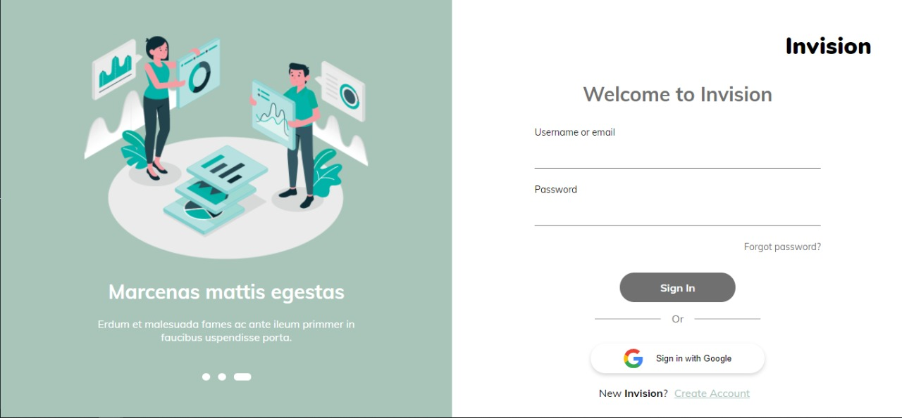

# Login and Register Screen

Login and registration screen developed using ReactJS, Typescript, Formik and Yup.

## The technologies used

- ReactJS
- Typescript
- Formik
- Yup
- React-elastic-carousel
- React-google-login

## Running the project

To start the project in a development environment, it will be necessary to have the NODE JS and Git installed.

[https://nodejs.org/en/download/](NodeJS download link or installation instructions)
[https://git-scm.com/downloads](Git Download link or installation instructions)

After installing NodeJS, you will need to clone the project in a folder on your computer.

To do this, just open a terminal or bash window and run the command `git clone https://github.com/maxarouca/login-register-screen.git`.

After finishing this process, open the folder where the project was cloned and install the dependencies. You can do this using the command: `npm install`.

When the dependencies are installed, just follow the instructions below:

## Available Scripts

In the project directory, you can run:

### `npm run start`

Runs the app in the development mode. 
Open [http://localhost:3000](http://localhost:3000) to view it in the browser.

The page will reload if you make edits. 
You will also see any lint errors in the console.

## Learn More

You can learn more in the [Create React App documentation](https://facebook.github.io/create-react-app/docs/getting-started).

To learn React, check out the [React documentation](https://reactjs.org/).
